# Reachy Mini Dances Library

Make your Reachy Mini steal the spotlight 🤖💃

This library brings your Reachy Mini to life with 20 pre-built dance moves and a flexible choreography system. Lock your dance routines to the beat with BPM adjustments and remix moves into custom performances in just a few lines of code.

##  See It In Action

<table>
  <tr>
    <td align="center">
      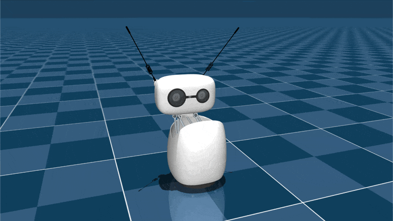
      <p><strong>Jackson Square</strong><br />Precision hits with shoulder pops</p>
    </td>
    <td align="center">
      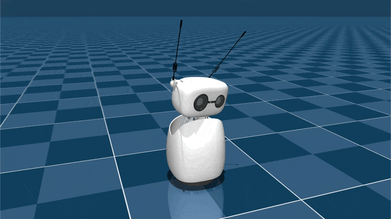
      <p><strong>Interwoven Spirals</strong><br />Layered spirals across axis</p>
    </td>
  </tr>
  <tr>
    <td align="center">
      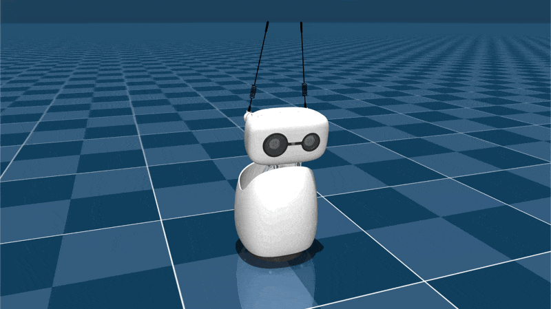
      <p><strong>Polyrhythm Combo</strong><br />Offset waves with counter beats</p>
    </td>
    <td align="center">
      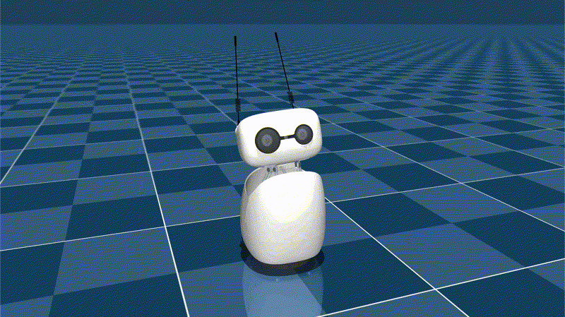
      <p><strong>Dizzy Spin</strong><br />Slow spin antenna flair</p>
    </td>
  </tr>
</table>

**Explore all 20 moves in the gallery below!**

## Features

- **20 Pre-built Moves** - Ready-to-run dances from subtle nods to complex routines
- **BPM Adjustments** - Keep every motion locked to the beat
- **Custom Choreography** - Combine motion primitives or load JSON choreographies to build your own routines
- **Interactive Mode** - Preview and test moves using keyboard controls

## Installation

Requires Python 3.10+ and installs the `reachy_mini` dependency.

```bash
pip install -e .
```

## Usage

Explore all available moves with interactive mode
```bash
python examples/dance_demo.py
```

**Controls:**
- `Right` or `Left` - Next / previous move
- `Space` or `P` - Pause / resume motion
- `W` - Cycle waveform
- `-` or `+` - Adjust amplitude
- `Up` or `Down` - Adjust BPM
- `Ctrl+C` or `Q` - Quit

### Run a Choreography

Execute a pre-defined dance sequence:

```bash
python examples/dance_demo.py --choreography ./examples/choreographies/another_one_bites_the_dust.json --no-keyboard
```

## Complete Move Library

All 20 dance moves currently available in the library, with more to come!

<table>
  <tr>
    <td align="center">
      
      <p><strong>Jackson Square</strong><br />Precision hits with shoulder pops</p>
    </td>
    <td align="center">
      
      <p><strong>Interwoven Spirals</strong><br />Layered spirals across axis</p>
    </td>
  </tr>
  <tr>
    <td align="center">
      
      <p><strong>Polyrhythm Combo</strong><br />Offset waves with counter beats</p>
    </td>
    <td align="center">
      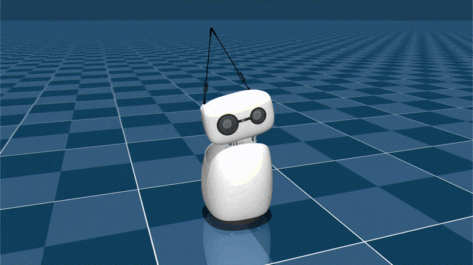
      <p><strong>Groovy Sway &amp; Roll</strong><br />Flowing sway with rolling torso</p>
    </td>
  </tr>
  <tr>
    <td align="center">
      
      <p><strong>Dizzy Spin</strong><br />Slow spin antenna flair</p>
    </td>
    <td align="center">
      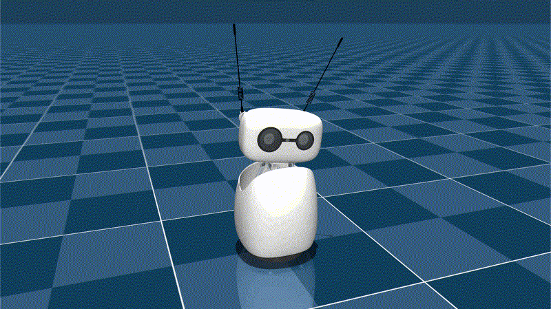
      <p><strong>Pendulum Swing</strong><br />Even tempo pendulum motion</p>
    </td>
  </tr>
  <tr>
    <td align="center">
      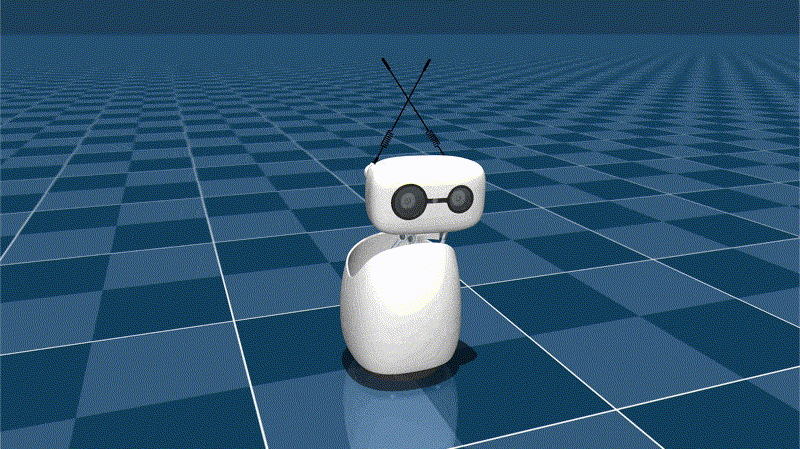
      <p><strong>Side-to-Side Sway</strong><br />Energetic side-to-side groove</p>
    </td>
    <td align="center">
      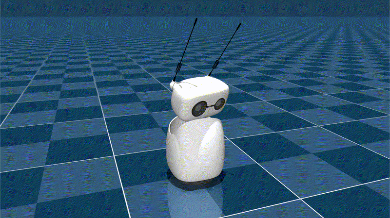
      <p><strong>Grid Snap</strong><br />Sharp grid-aligned accents</p>
    </td>
  </tr>
  <tr>
    <td align="center">
      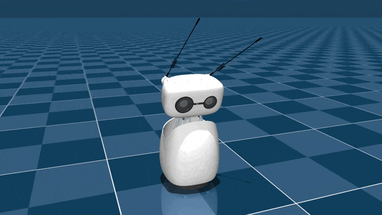
      <p><strong>Headbanger Combo</strong><br />High-energy head isolation</p>
    </td>
    <td align="center">
      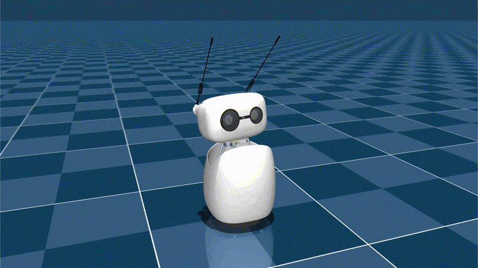
      <p><strong>Stumble &amp; Recover</strong><br />Playful stumble and recover</p>
    </td>
  </tr>
  <tr>
    <td align="center">
      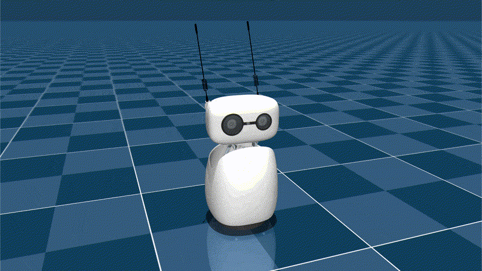
      <p><strong>Chicken Peck</strong><br />Pecking head bop loop</p>
    </td>
    <td align="center">
      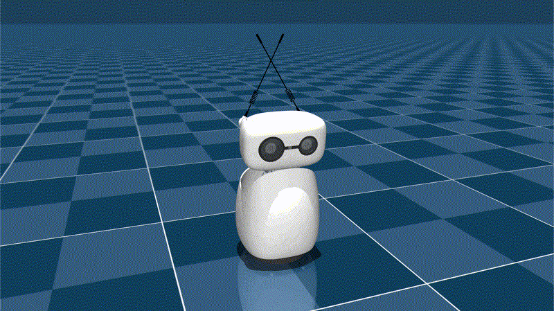
      <p><strong>Chin Lead</strong><br />Extended chin-led glides</p>
    </td>
  </tr>
  <tr>
    <td align="center">
      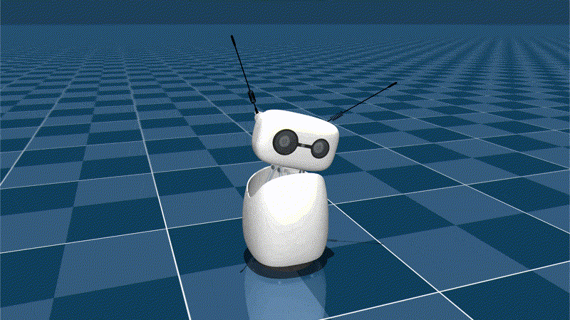
      <p><strong>Sharp Side Tilt</strong><br />Quick angular head tilt</p>
    </td>
    <td align="center">
      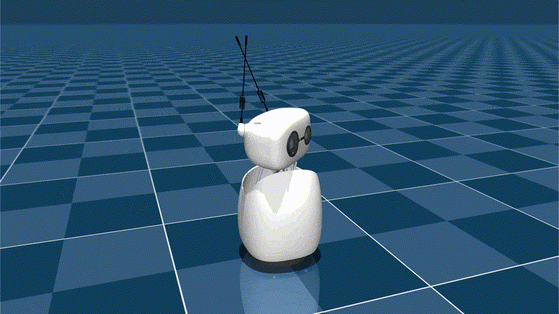
      <p><strong>Side Glance Flick</strong><br />Fast glance with flick</p>
    </td>
  </tr>
  <tr>
    <td align="center">
      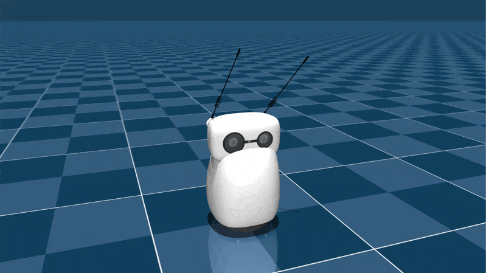
      <p><strong>Side Peekaboo</strong><br />Peekaboo side reveal</p>
    </td>
    <td align="center">
      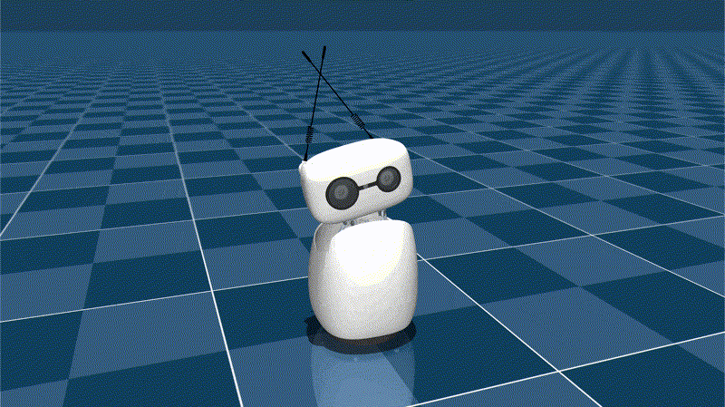
      <p><strong>Head Tilt Roll</strong><br />Gentle tilt loop</p>
    </td>
  </tr>
  <tr>
    <td align="center">
      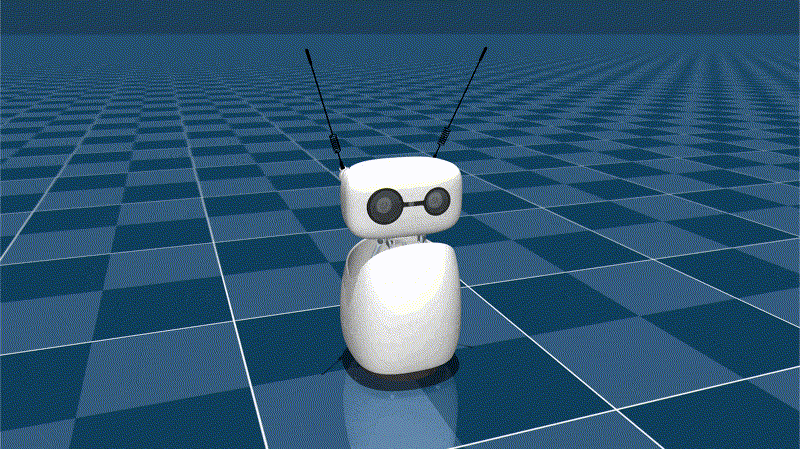
      <p><strong>Neck Recoil</strong><br />Snappy neck recoil pop</p>
    </td>
    <td align="center">
      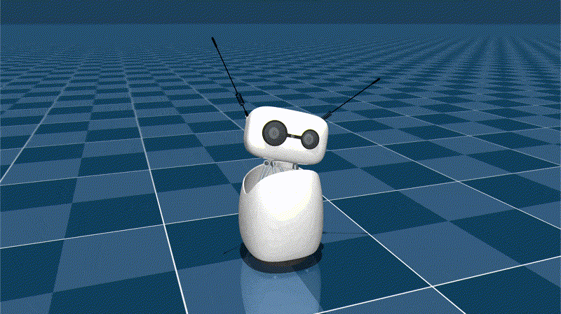
      <p><strong>Uh-Huh Tilt</strong><br />Bouncy affirmative tilt</p>
    </td>
  </tr>
  <tr>
    <td align="center">
      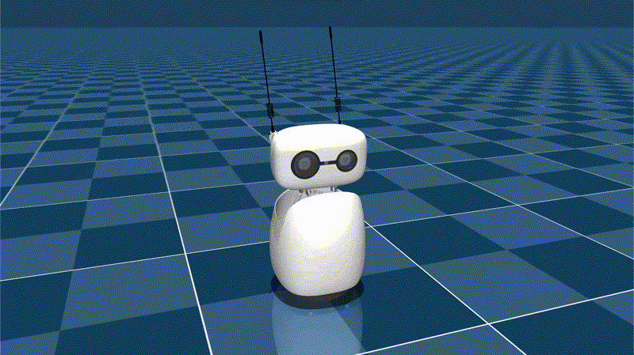
      <p><strong>Yeah Nod</strong><br />Enthusiastic yeah nod</p>
    </td>
    <td align="center">
      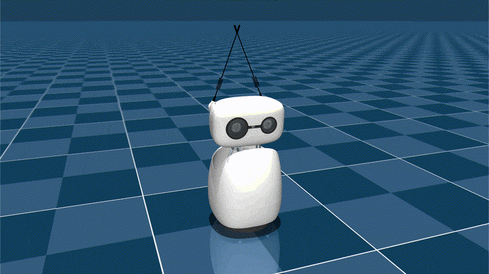
      <p><strong>Simple Nod</strong><br />Classic simple nod</p>
    </td>
  </tr>
</table>

*Tip: Run `python examples/dance_demo.py` to cycle through each move with keyboard controls!*

## Contributing

We welcome contributions from the community! If you want to report a bug or request a feature, please open an issue on GitHub. If you want to contribute code, please fork the repository and submit a pull request. If you're adding new moves, use this guide to create GIFs for the gallery:

### Recording GIFs for the gallery

1. **Stage the dances**
   - Add the dance move(s) to a JSON file in `examples/choreographies/` (or modify `another_one_bites_the_dust.json`)

2. **Run the dance moves**

   ```bash
   python examples/dance_demo.py --choreography ./examples/choreographies/<your-dances>.json --no-keyboard
   ```

3. **Record the MuJoCo window**
   - Use any GIF-capable screen recorder (CleanShot X on macOS, ShareX or Snipping Tool on Windows 11)
   - ***Pro tip:** Record multiple dances in one take (using the JSON file in *step 1*) to maintain consistent dimensions and save cropping effort*

4. **Slice individual clips (if multiple dances are recorded in one take)**

   - Use the start and end time of each move for `-ss` and `-to`
   - GIFs do not have to loop smoothly at this point, we will trim it in the next step

   ```bash
   ffmpeg -i all-dances.gif -ss 0 -to 3 -an <dance-move-name>.gif
   ```

5. **Trim the GIF**
   - Use Preview (on macOS, double click file > View > Thumbnail) or any GIF editor to trim the GIF so it loops smoothly
      - **Roughly match first and last frame**: Look at the first frame, then look for the **next closest frame that will lead into the first frame**, select and delete all frames after that point (shift click + delete)
   - Ensure GIF looping metadata and optimize file size with gifsicle:

  ```bash
  gifsicle --colors 256 -O3 --loopcount=0 -b --no-conserve-memory *.gif
  ```
